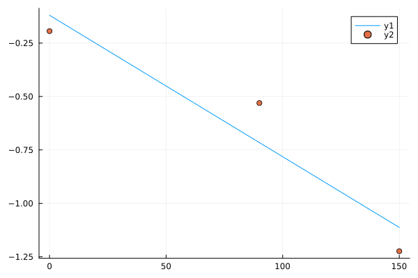

# Regression Techniques for Solving Real-World Problems

This comprehensive study explores the application of various regression techniques to solve a series of real-world problems. By examining polynomial regression, film ranking, weight loss prediction, tweet spread modeling, and forensic analysis using Newton's Law of Cooling, the study demonstrates the versatility and effectiveness of both linear and non-linear regression methods. Each case study provides detailed methodologies, results, and discussions, highlighting the importance of model selection, data transformation, and real-world considerations in achieving accurate and meaningful predictions. The overall conclusion synthesizes the key insights and potential future work to further enhance the robustness and applicability of regression techniques in diverse domains.

## Notes

To solve almost all the exercises, I will use some auxiliary functions. These functions will help streamline the process of creating matrices and polynomials for regression analysis.

```julia

function createPolynomial(c::Vector{<:Number})
    n = length(c) - 1
    poly(x) = sum(c[i+1] * x^i for i in 0:n)
    return poly
end

function calculateError(predicted::Vector{Float64}, actual::Vector{Float64})
    return sum((predicted .- actual) .^ 2)
end

function createMatrix(x, n)
    A = [ones(length(x), 1) x]
    for i in 2:n
        A = hcat(A, A[:, end] .* x)
    end
    return A
end

```


## Study Case: Analyzing the Behavior of Polynomial Regression Models on Synthetic Data

### Objective:

To investigate the behavior of polynomial regression models of varying degrees (from 0 to 29) on a dataset generated from a 5th degree polynomial. Specifically, to observe the error trend as the polynomial degree increases and to examine the feasibility and implications of using high-degree polynomials in regression.

### Methodology:

1. **Function Selection**: A 5th degree polynomial function was chosen:

$$
f(x) = \frac{(x-4)(x+5)(x-20)(x-9)(x+0) + 9}{1000}
$$

2. **Data Generation**:

- Generated 30 points from the selected polynomial, adding random Gaussian noise with a mean error of ±1.

- Julia programming language was employed for the computations.

```julia

numOfPoints = 30

x = range(-5, 10, length=numOfPoints)

samplePoints = f(x) .+ randn(numOfPoints)

y = samplePoints

```

![[Function and the Points]](./attachments/attachment-1.png)

3. **Vandermonde Matrix Creation**: Constructed a Vandermonde matrix to facilitate polynomial regression.

```julia

A = createMatrix(x, 3)

c = A \ samplePoints

polynomial = createPolynomial(c)

```

4. **Regression and Plotting**:

- Performed polynomial regression for degrees 0 to 29.

- Plotted the polynomial fits and calculated the total error for each degree.

- Examined the fit visually and via error plots.

### Results:

- **Initial Fit (Degree 3)**:

The initial fit with a degree 3 polynomial did not approximate the data well.

![[Degree 3 fit]](./attachments/attachment-2.png)

- **Improved Fit (Degree 4)**:

An improvement was observed with a degree 4 polynomial, but it still did not perfectly capture the underlying function.

![[Degree 4 Fit]](./attachments/attachment-3.png)

- **Optimal Fit (Degree 5)**:

As expected, the degree 5 polynomial closely matched the data, reflecting the true nature of the underlying function.

![[Degree 5 Fit]](./attachments/attachment-4.png)

- **Overfitting (Degree 6)**:

A degree 6 polynomial provided a slightly better fit but did not significantly improve upon the degree 5 polynomial.

![[Degree 6 Fit]](./attachments/attachment-5.png)

- **High-Degree Polynomial (Degree 29)**:

The degree 29 polynomial almost perfectly interpolated the data points, resulting in a very peculiar and precise fit. This behavior suggests a transition from regression to interpolation due to the high number of degrees matching the number of data points.

![[Degree 29 Fit]](./attachments/attachment-6.png)

- **Error Analysis**:

The error plot displayed an initial decrease in error with increasing polynomial degree, followed by an increase due to overfitting and numerical instability.

![[Error Plot]](./attachments/attachment-7.png)

### Discussion:

- **Polynomial Degree vs. Fit Quality**: The results highlighted that a polynomial degree equal to the true degree of the generating function (degree 5) provided the best fit. Increasing the degree beyond this point led to overfitting, especially evident in the degree 29 polynomial.

- **Regression vs. Interpolation**: When the degree of the polynomial matches the number of data points minus one, the polynomial perfectly interpolates the data, which may not generalize well to new data.

- **Numerical Stability**: High-degree polynomials can suffer from numerical instability, leading to increased error and poor generalization.

### Conclusion:

Polynomial regression effectively models data up to the true degree of the underlying function. Beyond this, higher-degree polynomials tend to overfit the data and may introduce numerical errors. This study underscores the importance of selecting an appropriate polynomial degree to balance fit quality and generalization.

## Study Case: Ranking Films Based on Student Preferences Using Least Squares

### Objective:

To determine the ranking of nine films based on the preferences of 13 students using the least squares method. The preferences were collected in a pairwise comparison format, where students chose between two films.

### Data Collection:

Student preferences were gathered for 14 comparisons between pairs of films, with the first film always being the winner in each comparison. The results of these comparisons are as follows:

1. Toy Story 12 x 1 Rocky

2. Back to the Future 8 x 5 Ferris Bueller's Day Off

3. The Incredibles 10 x 3 Dune

4. Batman Begins 7 x 5 Harry Potter and the Sorcerer's Stone

5. Shrek 11 x 2 Dune

6. Harry Potter 10 x 3 Rocky

7. Toy Story 9 x 4 Back to the Future

8. The Incredibles 9 x 4 Harry Potter and the Sorcerer's Stone

9. Ferris Bueller's Day Off 7 x 5 Dune

10. Back to the Future 7 x 5 Dune

11. Shrek 12 x 1 Rocky

12. The Incredibles 9 x 4 Batman Begins

13. Toy Story 8 x 5 Batman Begins

14. The Incredibles 10 x 3 Ferris Bueller's Day Off

### Methodology:

1. **Naming the Films**:

Each film was assigned a unique identifier:

```
## v1 Toy Story
## v2 Rocky
## v3 Back to the Future
## v4 Ferris Bueller's Day Off
## v5 The Incredibles
## v6 Dune
## v7 Batman Begins
## v8 Harry Potter 1
## v9 Shrek
```

2. **Matrix Representation**:

A matrix was constructed to represent the outcomes of each comparison. In this matrix, `1` indicates the film that won the comparison, and `-1` indicates the film that lost:

```julia
v1 = [ 1  0  0  0  0  0  1  0  0  0  0  0  1  0]
v2 = [-1  0  0  0  0 -1  0  0  0  0 -1  0  0  0]
v3 = [ 0  1  0  0  0  0 -1  0  0  1  0  0  0  0]
v4 = [ 0 -1  0  0  0  0  0  0  1  0  0  0  0 -1]
v5 = [ 0  0  1  0  0  0  0  1  0  0  0  1  0  1]
v6 = [ 0  0 -1  0 -1  0  0  0 -1 -1  0  0  0  0]
v7 = [ 0  0  0  1  0  0  0  0  0  0  0 -1 -1  0]
v8 = [ 0  0  0 -1  0  1  0 -1  0  0  0  0  0  0]
v9 = [ 0  0  0  0  1  0  0  0  0  0  1  0  0  0]
A = transpose([ v1; v2; v3; v4; v5; v6 ;v7 ;v8; v9])
```

3. **Outcome Vector**:

The difference in votes for each comparison was recorded in a vector `y`:

```julia

y = [11; 3; 7; 2; 9; 7; 5; 5; 2; 2; 11; 5; 3; 7]

```

4. **Least Squares Solution**:

The least squares solution was computed to determine the ranking:

```julia

c = A \ y

```

This produced the following coefficients:

```

4.04    ## c1 (Toy Story)

-6.89   ## c2 (Rocky)

-0.64   ## v3 (Back to the Future)

-2.51   ## b4 (Ferris Bueller's Day Off)

4.53    ## c5 (The Incredibles)

-3.45   ## c6 (Dune)

0.67    ## c7 (Batman Begins)

-0.56   ## c8 (Harry Potter 1)

4.82    ## c9 (Shrek)

```

### Results:

The rankings based on the least squares coefficients are as follows:

1. **Shrek (v9)**: 4.82
2. **The Incredibles (v5)**: 4.53
3. **Toy Story (v1)**: 4.04
4. **Batman Begins (v7)**: 0.67
5. **Back to the Future (v3)**: -0.64
6. **Harry Potter 1 (v8)**: -0.56
7. **Ferris Bueller's Day Off (v4)**: -2.51
8. **Dune (v6)**: -3.45
9. **Rocky (v2)**: -6.89

### Discussion:

- **Top Preferences**: Shrek emerged as the favorite film among the students, followed closely by The Incredibles and Toy Story.

- **Least Favorite**: Rocky was the least favored film in the comparisons.

- **Comparison with Other Results**: Discrepancies in the rankings compared to other methods (e.g., Python) might arise due to differences in the computational approach, as the system does not have a unique solution. Variations in least squares solutions can occur based on the specific implementation and numerical methods used.

### Conclusion:

This study successfully ranked nine films based on student preferences using the least squares method. The results align with the expected trends, where popular films received higher rankings. Future work could involve exploring alternative ranking methods and comparing their robustness and consistency.

## Study Case: Predicting Weight Loss Over Time Using Regression

### Objective:

To predict the future date on which an individual will weigh 110 kilograms based on past weight measurements using regression techniques. The goal is to argue the choice of regression model and to provide a reasoned prediction.

### Methodology:

1. **Data Preparation**:

- Weight measurements were taken over several months but not daily.

- Days were converted such that the first measurement occurred on day 1.

- The data points were extracted from the provided spreadsheet.

2. **Data Representation**:

- The days and corresponding weights were represented as vectors `x` and `y`, respectively.

```julia

days = [1; 2; ... ; 84]## Example days of measurements

weights = [120.6; 121.6; ... ; 115.3]## Corresponding weights

x = days

y = weights

```

3. **Matrix Creation and Least Squares Solution**:

- Created a Vandermonde matrix for linear regression.

- Solved for the coefficients using the least squares method.

```julia

A = createMatrix(days, 1)## Creating the matrix for linear regression

c = A \ y## Solving for coefficients

```

4. **Polynomial Creation**:

- Created a polynomial function based on the calculated coefficients.

- Defined a constant function to represent the target weight of 110 kilograms.

```julia

poly = createPolynomial(c)

ahundredandten(x) = 110

```

5. **Plotting and Prediction**:

- Plotted the data points and the regression line.

- Estimated the day when the weight would reach 110 kilograms.

```julia

plot(x, y)## Plotting data points

plot!(0:180, poly.(0:180))## Plotting the regression line

plot!(0:180, ahundredandten.(0:180))## Plotting the target weight line

```

![[Weight Prediction Plot]](./attachments/attachment-8.png)

### Results:

- **Linear Regression**:

The linear regression model (`Ax + B`) suggested that the individual would reach a weight of 110 kilograms approximately 175 days after the first measurement.

- **Quadratic Polynomial**:

A quadratic polynomial was also considered, but it resulted in an unrealistic prediction as it suggested a more rapid weight loss after initially fitting the data similarly to the linear model. This was deemed less sensible given the general trend of the data.

### Discussion:

- **Model Choice**:

The linear model was chosen because it provided a straightforward and reasonable fit to the data. The linear trend captured the gradual weight loss observed in the measurements.

- **Quadratic Model Concerns**:

While a quadratic model might offer a closer fit to the existing data points, it introduced an unrealistic steep decline in weight over time, which did not align with the expected gradual weight loss process.

- **Prediction Validity**:

The prediction of 175 days was based on the linear trend observed. This prediction assumes that the rate of weight loss remains constant, which is a simplification but reasonable given the available data.

### Conclusion:

Based on the linear regression model, the individual is predicted to weigh 110 kilograms approximately 175 days after the first recorded measurement. This model was chosen for its simplicity and reasonable fit to the data. Alternative models, such as quadratic regression, were considered but deemed less appropriate due to unrealistic trends.

## Study Case: Predicting Tweet Spread Using Non-Linear Least Squares Regression

### Objective:

To determine the time at which a spreading false news story on Twitter will reach 24,700 tweets. The relationship between time and the number of tweets is hypothesized to follow the model:

$$ \text{number of tweets} = 3^{c1 \cdot \text{time}} + 500 $$

where $c1$ is a constant to be determined.

### Data Collection:

Three data points were provided:

- At 15:35, there were 600 tweets.

- At 15:36, there were 1400 tweets.

- At 15:38, there were 3200 tweets.

### Methodology:

1. **Model Transformation**:

To linearize the given non-linear model, we applied a logarithmic transformation:

$$
\begin{gather}
\text{number of tweets} &= 3^{c1 \cdot \text{time}} + 500 \\
\text{number of tweets} - 500 &= 3^{c1 \cdot \text{time}} \\
\log_{3}(\text{number of tweets} - 500) &= \log_{3}(3^{c1 \cdot \text{time}}) \\
\log_{3}(\text{number of tweets} - 500) &= c1 \cdot \text{time}
\end{gather}
$$

2. **Variable Renaming**:

The transformed model is:

$$
y' = \log_{3}(y - 500) \quad \text{and} \quad x' = x
$$

where $y$ is the number of tweets and $x$ is the time.

3. **Linear Regression**:

- Applied linear regression to the transformed variables.

- Solved for the coefficient $c1$.

```julia

time = [0; 1; 3]

tweets = [600; 1400; 3200]

x = time

y = log.(3, tweets .- 500)


A = createMatrix(x, 1)

c = A \ y

poly = createPolynomial(c)

```

4. **Back Transformation**:

Converted the linearized model back to the original non-linear form:

```julia

func(x) = 3 ^ poly(x) + 500

```

5. **Plotting and Prediction**:

- Plotted the transformed model and the target tweet count.

- Estimated the time to reach 24,700 tweets.

```julia

twentyfourthousandsevenhundred(x) = 24700

rng = range(0, 5, length=200)

plot(rng, funcao.(rng))

plot!(rng, twentyfourthousandsevenhundred.(rng))

scatter!(x, y)

```

![[Tweet Spread Prediction Plot]](./attachments/attachment-9.png)

### Results:

- **Prediction**:

The model predicted that the number of tweets would reach 24,700 at approximately the end of the minute 15:39.

![[Tweet Spread Prediction Result]](./attachments/attachment-10.png)

### Discussion:

- **Model Choice**:

The logarithmic transformation allowed for a linear regression approach, simplifying the problem while maintaining the integrity of the non-linear growth model.

- **Accuracy**:

Given the rapid growth in the number of tweets, the model's prediction seems reasonable. However, real-world factors such as tweet rate variations and external influences were not considered.

- **Model Limitations**:

The model assumes a constant exponential growth rate, which may not hold over longer periods or with more complex social media dynamics.

### Conclusion:

Using logarithmic transformation and linear regression, we estimated that the false news story would reach 24,700 tweets by the end of 15:39. The method demonstrated a practical approach to handling non-linear growth patterns using linear regression techniques.

## Study Case: Solving a Crime Using Non-Linear Least Squares Regression

### Objective:

To determine the time of death of a person based on body temperature measurements using Newton's Law of Cooling. The body temperatures were recorded at 15:00 (34°C) and 16:30 (25°C). The ambient temperature remained stable at 20°C, and the normal body temperature is 37°C.

### Newton's Law of Cooling:

The law states that the rate of change of the temperature of an object is proportional to the difference between its own temperature and the ambient temperature:

$$ T(t) = (T_0 - T_f) \cdot e^{-k \cdot t} + T_f $$

where:

- $T(t)$ is the temperature at time $t$

- $T_0$ is the initial temperature (37°C)

- $T_f$ is the ambient temperature (20°C)

- $k$ is the cooling constant

- $t$ is the time elapsed

### Data Collection:

- **Initial Temperature (15:00)**: 34°C

- **Temperature after 90 minutes (16:30)**: 25°C

### Methodology:

1. **Model Transformation**:

To linearize the non-linear model, we applied a logarithmic transformation:

$$
\begin{gather}
T(t) = (T_0 - T_f) \cdot e^{-k \cdot t} + T_f \\\\
T(t) - T_f = (T_0 - T_f) \cdot e^{-k \cdot t} \\\\
\frac{T(t) - T_f}{T_0 - T_f} = e^{-k \cdot t} \\\\
\ln\left(\frac{T(t) - T_f}{T_0 - T_f}\right) = \ln\left(e^{-k \cdot t}\right) \\\\
\ln(T(t) - T_f) - \ln(T_0 - T_f) = -k \cdot t
\end{gather}
$$

2. **Variable Renaming**:

The transformed model becomes:

$$
y' = \ln\left(\frac{T(t) - T_f}{T_0 - T_f}\right) \quad \text{and} \quad x = t
$$



3. **Linear Regression**:

- Applied linear regression to the transformed variables.

- Solved for the cooling constant $k$.

```julia

time = [0; 90]

degrees = [34; 25]

x = time

y = log.((degrees .- 20) ./ (37 .- 20))


A = createMatrix(x, 1)

c = A \ y


poly = createPolynomial(c)

```

4. **Back Transformation**:

Converted the linearized model back to the original non-linear form:

```julia

func(t) = (37 - 20) * exp(poly(t)) + 20

```

5. **Plotting and Prediction**:

- Plotted the transformed model and the normal body temperature.

- Estimated the time of death.

```julia

thirtyseven(x) = 37

rng = range(-180, 0, length=200)

plot(rng, func.(rng))

plot!(-180:150, thirtyseven.(-180:150))

```

### Results:

- **Prediction**:

The model predicted that the body temperature was 37°C approximately 18 minutes before the police arrived at 15:00, which corresponds to around 14:42.

![[Time of Death Prediction Plot]](./attachments/attachment-12.png)

### Discussion:

- **Model Choice**:

The logarithmic transformation allowed for a linear regression approach, simplifying the problem while maintaining the integrity of Newton's Law of Cooling.

- **Accuracy**:

The prediction seems reasonable given the rapid cooling observed. However, real-world factors such as body size, clothing, and environmental conditions could affect the cooling rate.

- **Model Limitations**:

The model assumes a constant cooling rate and does not account for potential variations in environmental conditions or the body's initial temperature deviation.

### Conclusion:

Using logarithmic transformation and linear regression, we estimated that the person was likely killed around 14:42, approximately 18 minutes before the police arrived. The method provided a practical approach to handling non-linear cooling patterns using linear regression techniques.
